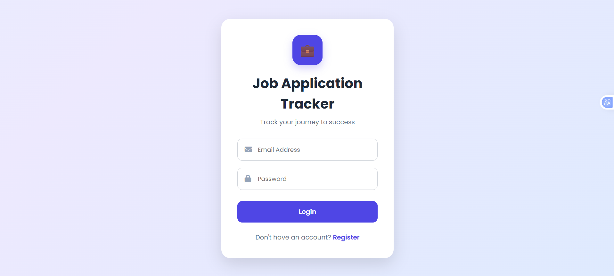
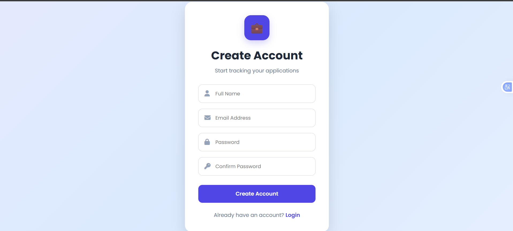
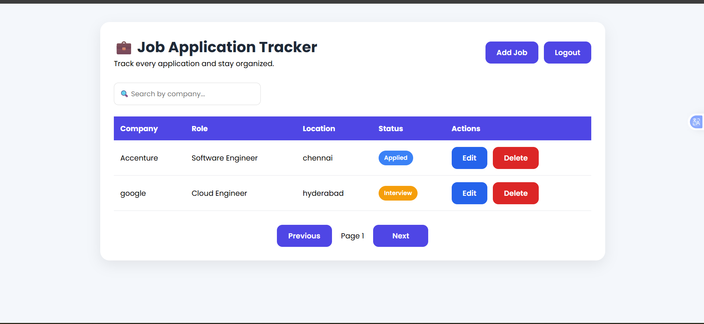
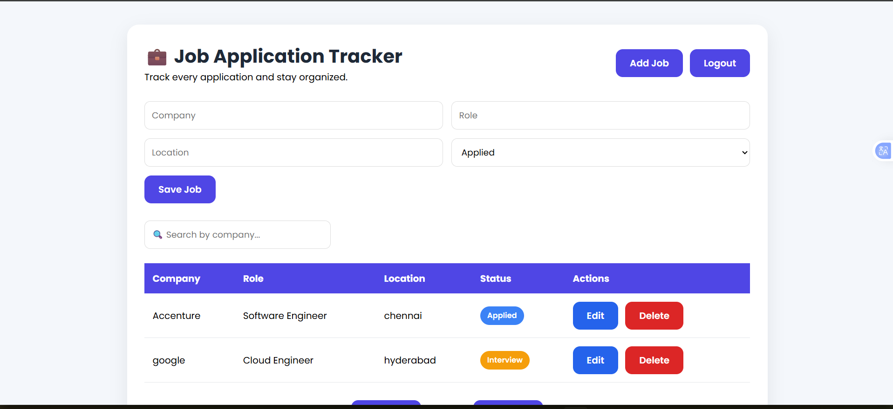
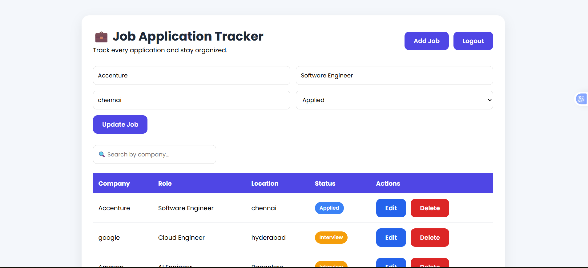
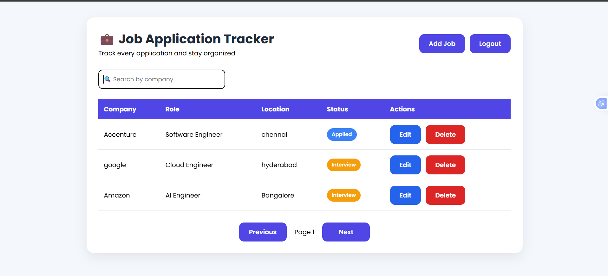
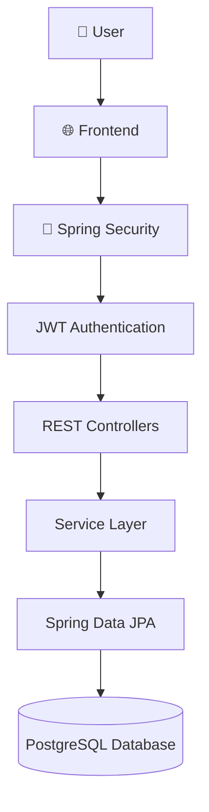
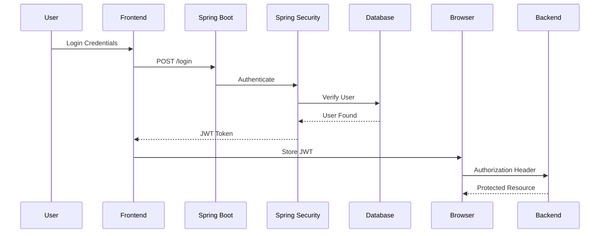

<div align="center">

# 💼 Job Application Tracker

### 🚀 A Secure Full-Stack Job Tracking Platform

Built with **Spring Boot**, **Spring Security**, **JWT Authentication**, **PostgreSQL**, **Docker**, and **Vanilla JavaScript**

<p>


</p>

---

### 📌 Manage your job applications securely from one centralized dashboard.

🔐 Authentication • 📋 CRUD Operations • 📊 Dashboard • ☁ Cloud Deployment • 🐳 Dockerized

</div>

---
# 🌐 Live Demo

### 🚀 Frontend

> https://jobtracker-azure.vercel.app

### ⚙ Backend API

> https://jobtracker-va8g.onrender.com

---
# 📚 Table of Contents

- [✨ Features](#-features)
- [🛠 Tech Stack](#-tech-stack)
- [📷 Screenshots](#-screenshots)
- [🏗 Architecture](#-architecture)
- [📂 Project Structure](#-project-structure)
- [🔐 Authentication Flow](#-authentication-flow)
- [📡 REST API](#-rest-api)
- [⚙ Installation](#-installation)
- [🐳 Docker](#-docker)
- [☁ Deployment](#-deployment)
- [🚀 Future Enhancements](#-future-enhancements)
- [👨‍💻 Author](#-author)

---
# ✨ Features

## 🔐 Secure Authentication

- ✅ User Registration
- ✅ User Login
- ✅ JWT Authentication
- ✅ BCrypt Password Encryption
- ✅ Stateless Authentication
- ✅ Protected REST APIs

---

## 💼 Job Management

- ➕ Add Job Applications

- ✏ Edit Job Applications

- ❌ Delete Applications

- 🔍 Search Jobs

- 🏢 Filter by Company

- 📌 Track Application Status

- 📄 Pagination Support

---

## 📊 Dashboard

- 📱 Responsive Design

- 🎨 Modern UI

- 📋 Interactive Table

- 🔍 Search Functionality

- 📄 Pagination

---

## ☁ Deployment

- 🐳 Dockerized Backend

- ☁ Hosted on Render

- 🌐 Frontend on Vercel

- 🗄 PostgreSQL Database

# 🛠 Tech Stack

| Category | Technology            |
|-----------|-----------------------|
| Language | Java 17               |
| Backend | Spring Boot           |
| Security | Spring Security       |
| Authentication | JWT                   |
| ORM | Hibernate             |
| Persistence | Spring Data JPA       |
| Database | PostgreSQL            |
| Frontend | HTML, CSS, JavaScript |
| Build Tool | Maven                 |
| Containerization | Docker                |
| Deployment | Render                |
| Frontend Hosting | Vercel                |

# 📷 Application Screenshots

---

## 🔐 Login Page


<p align="center">

</p>

---

## 📝 Register Page

<p align="center">

</p>

---

## 📊 Dashboard

<p align="center">

</p>

---

## ➕ Add Job

<p align="center">

</p>

---

## ✏ Edit Job

<p align="center">

</p>

---

## 🔍 Search Jobs

<p align="center">

</p>

---
# 🏗 System Architecture


# 📂 Project Structure

```text
jobtracker
│
├── frontend
│     ├── css
│     ├── js
│     ├── login.html
│     ├── register.html
│     └── dashboard.html
│
├── src
│
│   ├── main
│   │
│   ├── controller
│   ├── service
│   ├── repository
│   ├── entity
│   ├── dto
│   ├── config
│   ├── security
│   └── exception
│
├── src/test
│
├── images
│
├── Dockerfile
│
├── pom.xml
│
└── README.md
```

---
# 🔐 Authentication Flow



---
# ⭐ Project Highlights

✔ Production Ready

✔ Secure JWT Authentication

✔ Spring Security

✔ RESTful APIs

✔ Responsive UI

✔ Dockerized Backend

✔ PostgreSQL Database

✔ Cloud Deployment

✔ Pagination

✔ Search Functionality

✔ Layered Architecture

✔ Clean Code Principles

✔ Exception Handling

✔ Global Exception Handler

✔ Maven Build

✔ Git Version Control

---
# 📡 REST API

## 🔐 Authentication APIs

| Method | Endpoint | Description |
|---------|----------|-------------|
| POST | `/api/auth/register` | Register a new user |
| POST | `/api/auth/login` | Authenticate user and return JWT |

---

## 💼 Job APIs

| Method | Endpoint | Description |
|---------|----------|-------------|
| GET | `/api/jobs` | Get all jobs |
| GET | `/api/jobs/{id}` | Get job by ID |
| POST | `/api/jobs` | Create a new job |
| PUT | `/api/jobs/{id}` | Update a job |
| DELETE | `/api/jobs/{id}` | Delete a job |
| GET | `/api/jobs/search` | Search jobs |
| GET | `/api/jobs/company/{company}` | Filter by company |

---
# ⚙ Installation

## 1️⃣ Clone the Repository

```bash
git clone https://github.com/John-PaulX/jobtracker.git

cd jobtracker
```

---

## 2️⃣ Configure Database

Update the following properties in `application.properties`.

```properties
spring.datasource.url=YOUR_DATABASE_URL

spring.datasource.username=YOUR_USERNAME

spring.datasource.password=YOUR_PASSWORD
```

---

## 3️⃣ Build the Project

```bash
mvn clean install
```

---

## 4️⃣ Run the Application

```bash
mvn spring-boot:run
```

Backend will start on

```
http://localhost:8080
```

---
# 🐳 Docker

## Build Docker Image

```bash
docker build -t jobtracker .
```

## Run Docker Container

```bash
docker run -p 8080:8080 jobtracker
```

---
# ☁ Deployment

| Component | Platform |
|------------|----------|
| Backend | Render |
| Frontend | Vercel |
| Database | PostgreSQL |
| Container | Docker |

---
# 🧪 Testing

> Unit tests using **JUnit 5** and **Mockito** will be added in the upcoming phase.

Planned Coverage:

- Service Layer
- Controller Layer
- Repository Layer
- Security Components

---
# 🚀 Future Enhancements

- 🧪 Unit & Integration Testing
- 📊 Dashboard Analytics
- 📅 Interview Scheduler
- 📧 Email Notifications
- 📱 Progressive Web App (PWA)
- 🌙 Dark Mode
- 📎 Resume Upload
- 🔍 Advanced Filtering
- 📈 Charts & Reports
- 🔔 Push Notifications
- 📤 Export Applications to Excel/PDF

---
# 🤝 Contributing

Contributions are welcome!

If you'd like to improve this project:

1. Fork the repository
2. Create a new feature branch
3. Commit your changes
4. Push to your branch
5. Open a Pull Request

---
# 📜 License

This project is licensed under the MIT License.

---
# 👨‍💻 Author

## John Paul Gummadi

Full-Stack Developer | Java | Spring Boot | REST APIs

📧 Email: johnpaulgummadi@gmail.com

💼 LinkedIn: https://www.linkedin.com/in/john-paul7/

🐙 GitHub: https://github.com/John-PaulX

⭐ If you found this project useful, consider giving it a **Star**.

---
